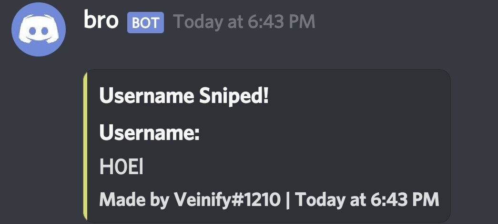

# Roblox Rare UserName Generator
Easy to use Roblox rare username generator

This is literally easy to use. ~~However the (very) bad part about this generator is that it can't detect if the username is filtered by Roblox or not. So most of the usernames that have been generated are filtered.~~ **FIXED**😏

This generator also supports Discord Webhooks!

# Requirements:
 - [Node.js](https://nodejs.org/en/download/) v10+
# Installation:
 - Rename `config.example.js` to `config.js`
 - Open the file and you can change your configuration there. (auto start, discord webhook, etc.)
 - Run `npm install` in your terminal
 - After installing the modules, You now can start the generator by running `node .` or `npm start` in your terminal.

# Contributing
Please refer to each project's style and contribution guidelines for submitting patches and additions. In general, we follow the "fork-and-pull" Git workflow.

1. **Fork** the repo on GitHub
2. **Clone** the project to your own machine
3. **Commit** changes to your own branch
4. **Push** your work back up to your fork
5. **Submit** a Pull request so that we can review your changes
